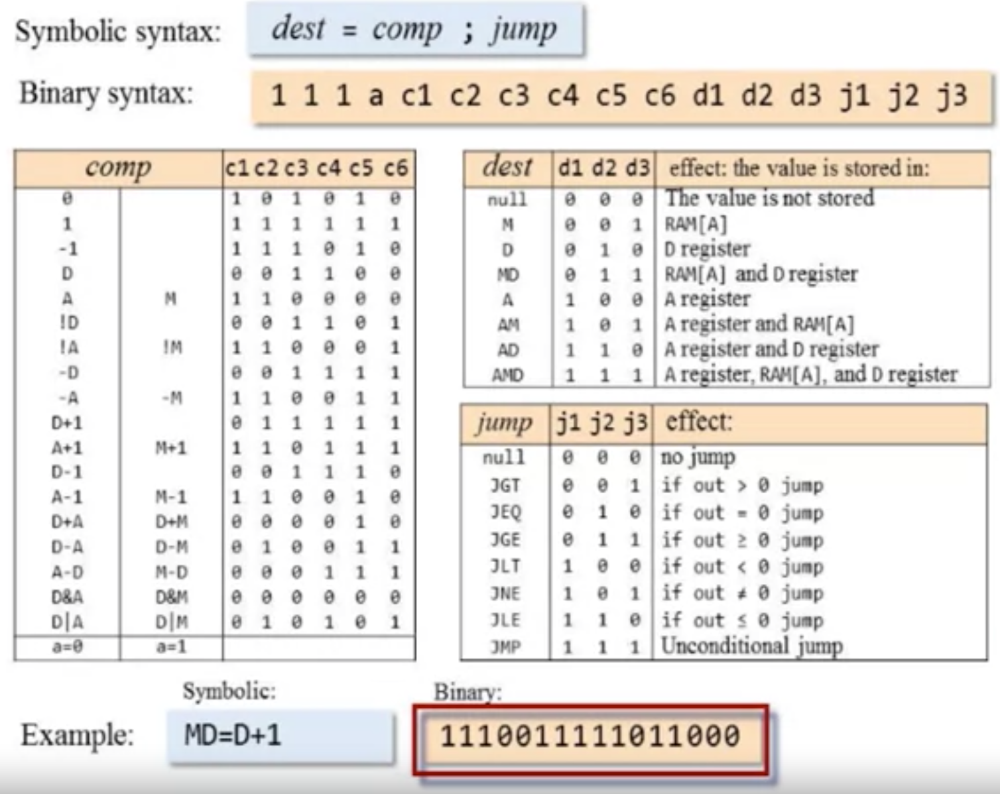

## Hack Assembler

#### Types of text

1. Instruction
   1. A instruction
   2. C instruction
2. White space -> ignore
3. Symbols
   1. A instructions
   2. Labels
   3. Predefined symbols

#### A instructions `@value`

```
// example 1
@21

// example 2
@x
```

##### Steps to convert to binary

1. `value` is decimal constant
   1. Convert to 15-bit binary equivalent and `leftPad` a `0` to denote an A instruction
2. `value` is a symbol
   1. Discussed in symbol handling

#### C instructions `dest = comp ; jump`

```
// example
MD = D + 1
```

##### Steps to convert to binary

1. All `C instructions` start with `111`
2. Next `7 bits` correspond to `comp`
   1. Refer table for exact code
3. Next `3 bits` correspond to `dest`
   1. Refer table for exact code
4. Next `3 bits` correspond to `dest`
   1. Refer table for exact code

<p align="center">

</p>

#### Symbols

###### Passes

1. Add all the label symbols to the symbol table
2. Add all the variable symbols to the symbol table if they haven't been encountered before
3. To resolve a symbol, look it up from the symbol table

##### 1. Predefined symbols

```
// example 1
@R0

// example 2
@KBD
```

Convert to corresponding value

##### 2. Labels

```
// example 1
(LOOP)

// example 2
@STOP
```

1. `(XXX)` will refer to the next instruction in the program
2. `@labelSymbol` can just be replaced with its corresponding value

##### 3. A instruction variable symbols

```
// example
@i
```

1. The variable gets mapped to an address in the RAM starting from `16` at first occurrence
2. If the variable has already been seen, it gets replaced by the corresponding value

## The overall process

1. Initialisation
   1. Construct an empty symbol table
   2. Add the pre-defined symbols to the symbol table
   3. <p align="center"></p>
2. First pass
   1. Scan the entire program
   2. For instruction of the form `(XXX)`
      1. Add the pair `(XXX, address)` to the symbol table, where `address` is the number of the instruction following `(XXX)`
3. Second pass
   1. Set `n = 16`
   2. Scan the entire program again
   3. For each instruction
      1. If the instruction is `@symbol`, look up the `symbol` in the symbol table
         1. If `(symbol, value)` is found, use `value` to complete the instruction's translation
         2. If not found
            1. Add `(symbol, n)` to the symbol table
            2. Use `n` to complete the instruction translation
            3. `n++`
      2. If the instruction is a C-instruction, complete the translation
      3. Write the instruction in the output file
